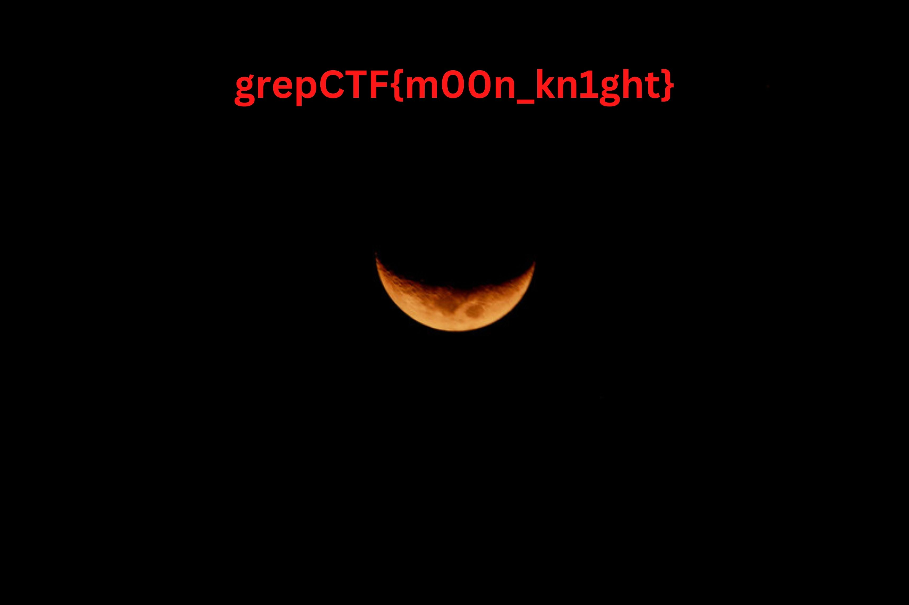

## Doctored image

### Desc
The extension of a file isn't all that matters


### Sol
The first 10 bytes of the image have been deleted. Using a hex editor like https://hexed.it, change the bytes to ```FF D8 FF E0 00 10 4A 46 49 46``` to get the original image


flag: grepCTF{m00n_kn1ght}